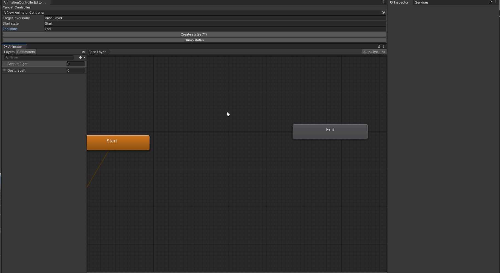

# 7*7 Gesture Generator
VRChat Avatar3.0向けに、すべてのGestureの組み合わせに対してStateとTransitionを生成するスクリプトです。
* Target Controller: 適用したいAnimatiorContorller
* Target layer name: そのAnimatiorControllerに入っている適用したいレイヤー名
* Start State: Transitionの起点になるState名
* End State: Transitionの起点になるState名
を指定して、`Crete states 7*7` を押すと、AnimatorControllerが生成されます。

